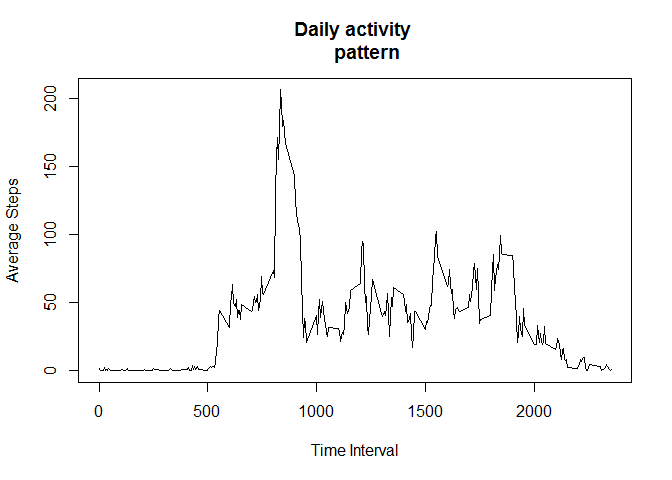
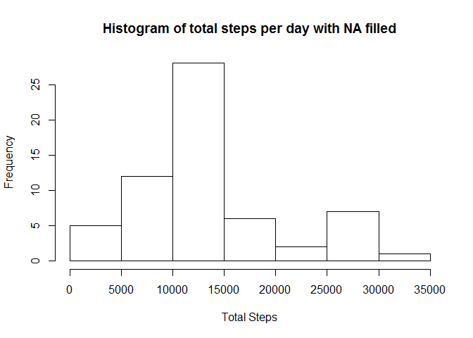

# Reproducible Research: Peer Assessment 1
Peer Assessment 1
=================

*This is my first R markdown and it is for the peer assessment 1 for course Reproducible data*

##1.Loading and preprocessing the data

```r
setwd("~/GitHub/RepData_PeerAssessment1");
actData = read.csv("activity.csv");
actData[,2]=as.character(actData[,2]);
actData[,2]=as.Date(actData[,2],"%Y-%m-%d");
summary(actData);
```

```
##      steps             date               interval     
##  Min.   :  0.00   Min.   :2012-10-01   Min.   :   0.0  
##  1st Qu.:  0.00   1st Qu.:2012-10-16   1st Qu.: 588.8  
##  Median :  0.00   Median :2012-10-31   Median :1177.5  
##  Mean   : 37.38   Mean   :2012-10-31   Mean   :1177.5  
##  3rd Qu.: 12.00   3rd Qu.:2012-11-15   3rd Qu.:1766.2  
##  Max.   :806.00   Max.   :2012-11-30   Max.   :2355.0  
##  NA's   :2304
```

##2.Mean total number of steps taken per day

```r
library(plyr);
dt=na.omit(actData);
stepsAnly=ddply(dt,~date,summarize,meanStep=mean(steps),totalStep=sum(steps));
stepsMedian=median(stepsAnly$totalStep);
stepsMean = mean(stepsAnly$totalStep);
hist(stepsAnly$totalStep,breaks = 10,main="Histogram of total steps per day",
     xlab="Total Steps");
```

 

The mean of total number of steps taken per day is 1.0766189\times 10^{4} steps. And the median of total number of steps taken per day is 10765 steps.

##3.Average daily activity pattern

```r
stepPattern = ddply(dt,~interval,summarize,pattern=mean(steps));
stepMaxInterval = stepPattern[which.max(stepPattern[,2]),1];
hour=floor(stepMaxInterval/100);
minute=stepMaxInterval%%100;
plot(stepPattern$interval,stepPattern$pattern,type="l",main="Daily activity 
     pattern",xlab="Time Interval",ylab="Average Steps");
```

 

The maximum number of steps occurs at 8:35.

##4. Imputing missing values

```r
nNA = sum(is.na(actData[,1]));
dtf = actData;
for(i in 1:nrow(dtf)){
  if(is.na(dtf[i,1])){
    dtf[i,1] = sample(unique(dt[(dt[,3]==dtf[i,3]),1]), size=1);
  }
}
stepsAnlyFilled=ddply(dtf,~date,summarize,meanStep=mean(steps),totalStep=sum(steps));
stepsMedianFilled=median(stepsAnlyFilled$totalStep);
stepsMeanFilled = mean(stepsAnlyFilled$totalStep);
hist(stepsAnlyFilled$totalStep,breaks = 10,main="Histogram of total steps per day with NA filled",
     xlab="Total Steps");
```

 

The filling stratgy is to replace the NA value with a random value that exist in the same time slot of the rest part of none-NA data. 

The mean of total number of steps taken per day is 1.3048967\times 10^{4} steps, and comparing to the previous mean as 1.0766189\times 10^{4}. 
The median of total number of steps taken per day is 11458 steps, and comparing to the previous mean as 10765.

After replacing the NA value, both the mean and the median gets larger because the filling strategy is to always add a number that larger than 0 at the place of NA. And previous NA would function like a 0 when calculating mean and median.  

##5. Activity patterns between weekdays and weekends

```r
dtf$TimeOfWeek<-ifelse(weekdays(dtf$date,TRUE)=="Sun"|weekdays(dtf$date,TRUE)=="Sat","weekends","weekdays")
stepPatternWD = ddply(dtf[dtf$TimeOfWeek=="weekdays",],~interval,summarize,pattern=mean(steps));
stepPatternWE = ddply(dtf[dtf$TimeOfWeek=="weekends",],~interval,summarize,pattern=mean(steps));
par(mfrow = c(2,1), mar=c(4,4,2,1));
plot(stepPatternWD$interval,stepPatternWD$pattern,type="l",ylim=c(0,200),
     xlab="Interval",ylab="Number of Steps",main="weekdays");
plot(stepPatternWE$interval,stepPatternWE$pattern,type="l",ylim=c(0,200),
     xlab="Interval",ylab="Number of Steps",main="weekends");
```

 
